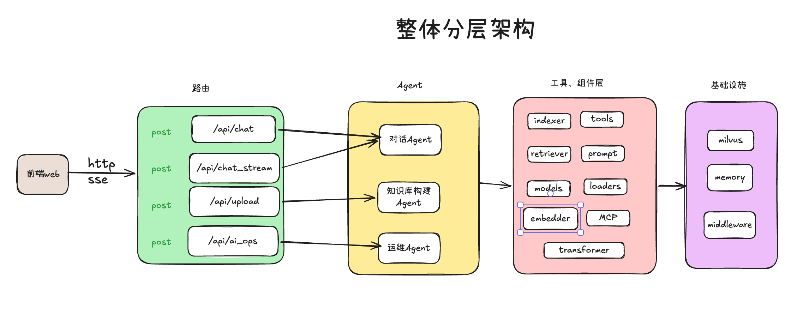
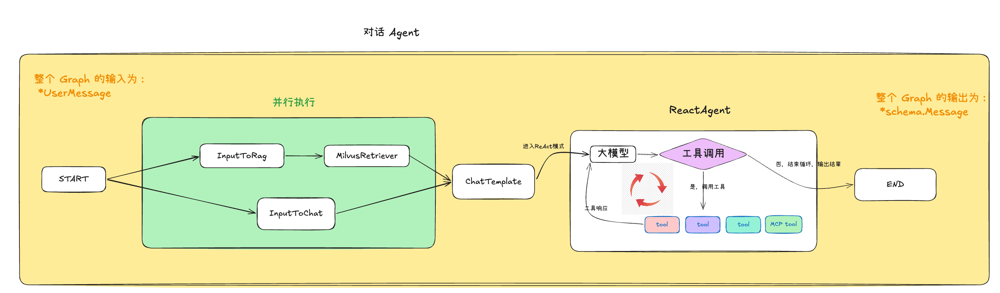
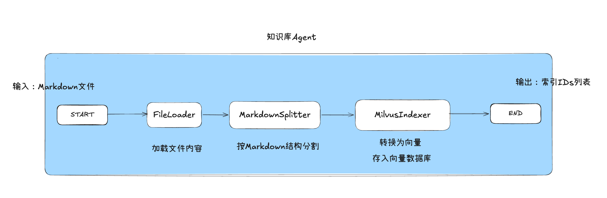
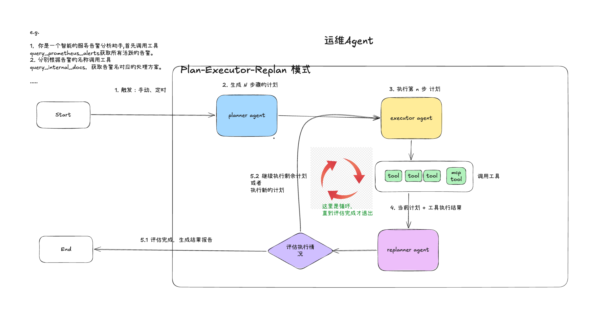

# 智能 OnCall Agent 项目 ｜ 大模型Agent开发项目

简单来说，是一个基于AI的企业级运维自动化助手，项目背景是解决实际企业级问题的，并不是玩具项目。目的是解决传统 Oncall 值班中，人工值守和排查问题的低效痛点，通过整合【知识库Agent】、【对话Agent】、【运维Agent】三大核心Agent能力，实现问题自动应答和故障智能排查的一体化服务，降低团队 Oncall的人力成本，提升团队效率。

本文章的目的就是对这个整个代码结构、功能实现做一个自我分析和总结，分享于大家。

项目地址：https://github.com/gofish2020/OncallAgent 欢迎学习 Fork && Star

## 一、系统概览

**系统名称**：智能 OnCall Agent 项目
**核心功能**：基于AI的告警处理、智能问答与运维分析  
**技术栈**：  

- 后端：Go + GoFrame + Eino AI框架（这个字节开源的 AI Agent开发的框架，文档：https://www.cloudwego.io/zh/docs/eino/）
- 前端：原生JavaScript + HTML/CSS（这里的前端是通过 vibe coding写的，不是本文章的重点）
- AI服务：Qwen3向量模型（配置中的doubao_embedding_model，其实是千问3的向量模型）、Ollama本地向量模型、DeepSeek大模型
- 向量数据库：`Milvus`
- 日志系统：腾讯云CLS（通过MCP协议）


## 二、环境配置

### 下载代码

```bash
git clone https://github.com/gofish2020/OncallAgent.git
```

### 启动 docker

```bash
cd ./manifest/docker
docker-compose up -d
```

### 配置 config.yaml 

```bash
cd ./manifest/config
# 先复制一份
cp config.example.yaml config.yaml

# 按照 config.yaml 中的注释信息，把各种API Key 自行申请即可（！！！重要！！！）
```

### 安装 Ollama

因为代码中用的本地的 `Ollama`来运行的 `nomic-embed-text`这个向量模型（主要是为了省钱）。这里我把 Ollama 的完整安装这里写下。 Ollama 你可以理解为 Docker，Docker是给开发好的软件提供一个运行环境，Ollama是给模型的运行提供一个独立的运行环境

```bash
# 先去这里下载 Ollama,并且安装
https://ollama.com/download
# 这里有很多本地部署模型、Embedding 等....
https://ollama.com/search?c=embedding
# 在命令行执行如下命令，下载 nomic-embed-text 这个向量模型（下载前记得把 ollama 这个程序启动起来，就是点击下图标运行）
ollama pull nomic-embed-text

```

如果你希望使用其他的 Embedding模型，用上面的 pull 自行下载即可，不过记得同步更新 `config.yaml`中的模型名字

```yaml
ollama_embedding_model: 
  model: "nomic-embed-text" # 这里的model 名字
  base_url: "http://localhost:11434"
```

## 三、启动命令

### 启动后端

```bash
# 启动后端(在项目目录)
go run main.go
# 服务启动在 http://localhost:6872
```

### 启动前端

```bash
# 启动前端
cd SuperBizAgentFrontend
chmod a+x start.sh
./start.sh
# 访问 http://localhost:8000
```


---

## 四、后端系统架构

### 4.1 整体分层架构



### 4.2 主入口点

**文件**：`main.go`

```go
func main() {
    ctx := gctx.New()
    s := g.Server()  // GoFrame服务器实例
    
    s.Group("/api", func(group *ghttp.RouterGroup) {
        group.Middleware(middleware.CORSMiddleware)      // CORS跨域
        group.Middleware(middleware.ResponseMiddleware)  // 响应格式统一
        group.Bind(chat.NewV1())  // 绑定Chat控制器
    })
    
    s.SetPort(6872)  // 监听端口
    s.Run()
}
```

**启动流程**：
1. 初始化GoFrame框架上下文
2. 设置中间件（CORS、响应格式化）
3. 注册API路由组 `/api`
4. 启动HTTP服务器（端口6872）

---

### 4.3 请求类型

**文件**：`api/chat/v1/chat.go`

| 端点 | 方法 | 功能 | 请求类型 |
|------|------|------|---------|
| `/api/chat` | POST | 快速对话 | ChatReq → ChatRes |
| `/api/chat_stream` | POST | 流式对话 | ChatStreamReq → ChatStreamRes |
| `/api/upload` | POST | 文件上传 | FileUploadReq → FileUploadRes |
| `/api/ai_ops` | POST | AI运维分析 | AIOpsReq → AIOpsRes |

**核心请求结构**：
```go
type ChatReq struct {
  	g.Meta   `path:"/chat" method:"post" summary:"对话"`
    Id       string  // 会话ID
    Question string  // 用户问题
}

type ChatStreamReq struct {
  	g.Meta   `path:"/chat_stream" method:"post" summary:"流式对话"`
    Id       string  // 会话ID
    Question string  // 用户问题
}

type AIOpsReq struct {
  	// AI运维分析的统一请求入口
  	g.Meta `path:"/ai_ops" method:"post" summary:"AI运维"`
    
}

type FileUploadReq struct {
	g.Meta `path:"/upload" method:"post" mime:"multipart/form-data" summary:"文件上传"`
}
```

---

### 4.4 控制层实现

**文件**：internal/controller/chat/

#### 4.4.1 Chat - 快速对话接口

**文件**：chat_v1_chat.go

```
请求流程：
  ChatReq(Id, Question)
    ↓
  构建UserMessage {ID, Query, History}
    ↓
  调用chat_pipeline.BuildChatAgent(ctx)构建对话agent
    ↓
  agent.Invoke() 执行推理
    ↓
  将用户消息和AI回复存入会话内存
    ↓
  返回 ChatRes(Answer)
```

**关键代码逻辑**：

```go
func (c *ControllerV1) Chat(ctx context.Context, req *v1.ChatReq) (res *v1.ChatRes, err error) {
    userMessage := &chat_pipeline.UserMessage{
        ID:      req.Id,
        Query:   req.Question,
        History: mem.GetSimpleMemory(req.Id).GetMessages(),  // 获取历史对话
    }
    
    runner, err := chat_pipeline.BuildChatAgent(ctx)  // 构建聊天管道
    out, err := runner.Invoke(ctx, userMessage)       // 执行推理
    
    // 更新会话内存
    mem.GetSimpleMemory(req.Id).SetMessages(schema.UserMessage(req.Question))
    mem.GetSimpleMemory(req.Id).SetMessages(schema.SystemMessage(out.Content))
    
    return &v1.ChatRes{Answer: out.Content}, nil
}
```


#### 4.4.2 ChatStream - 流式对话接口

**文件**：chat_v1_chat_stream.go

```
请求流程：
  ChatStreamReq(Id, Question)
    ↓
  创建SSE(Server-Sent Events)客户端连接
    ↓
  构建UserMessage {ID, Query, History}
    ↓
  调用agent.Stream()获取流式响应
    ↓
  逐块接收chunk，发送给客户端 (SendToClient)
    ↓
  流结束时保存完整对话到内存
    ↓
  返回完成信号
```

**数据流特点**：
- 使用`SSE`实现服务器推送
- 实时流式返回AI的逐块生成结果
- 在流式传输中维持客户端连接

#### 4.4.3 AIOps - AI运维分析接口

**文件**：chat_v1_ai_ops.go

```
执行流程：
  AIOpsReq
    ↓
  调用plan_execute_replan.BuildPlanAgent(ctx, query)
    ↓
  [规划阶段 Planner]
    • 使用DeepSeek V3思维模型生成处理计划
    
  [执行阶段 Executor]
    • 调用工具集：
      - query_prometheus_alerts: 查询活跃告警
      - query_internal_docs: 查询告警处理文档
      - get_current_time: 获取当前时间
      - query_log: 查询日志（通过MCP）
    
  [重规划阶段 Replanner]
    • 根据执行结果重新评估计划
    • 迭代最多20次
    
  返回 AIOpsRes(Result, Detail)
    Result: 最终的告警分析报告
    Detail: 各步骤的详细输出
```

**AI运维核心Prompt**：
```
1. 获取所有活跃告警 → query_prometheus_alerts
2. 逐个查询告警对应的处理文档 → query_internal_docs
3. 查询相关日志和指标 → query_log/query_metrics
4. 生成告警分析报告格式：
   - 告警处理详情
   - 活跃告警清单
   - 告警根因分析
   - 处理方案执行
   - 结论
```

---

### 4.5 AI Agent代码结构

这里的 `Agent`的构架，都是使用的 字节的框架 `Eino`。读音类似于：` I know`。

**最重要注意的点在于，每个节点的【输入数据类型】要和前一个节点的【输出数据类型】保持一致。**

#### 4.5.1 Chat Pipeline - 对话Agent

**文件**：internal/ai/agent/chat_pipeline/orchestration.go

**架构图**：



**管道流程**：

| 步骤 | 节点 | 功能 | 输入 | 输出 |
|------|------|------|------|------|
| 1 | InputToRag | Query 提取 | UserMessage | query string |
| 2 | InputToChat | 上下文构建 | UserMessage | {content, history, date} |
| 3 | MilvusRetriever | RAG 检索 | query string | 相关文档列表 docments |
| 4 | ChatTemplate | 提示词模板构建 | docments + history + content + date | 格式化消息 []*schema.Message |
| 5 | ReactAgent | LLM推理+工具调用 | 格式化消息 []*schema.Message | *schema.Message |

**关键代码**：

```go
func BuildChatAgent(ctx context.Context) compose.Runnable[*UserMessage, *schema.Message] {
    g := compose.NewGraph[*UserMessage, *schema.Message]()
    
    // 添加节点
    g.AddLambdaNode("InputToRag", newInputToRagLambda)
    g.AddChatTemplateNode("ChatTemplate", chatTemplate)
    g.AddLambdaNode("ReactAgent", reactAgent)
    g.AddRetrieverNode("MilvusRetriever", milvusRetriever, compose.WithOutputKey("documents"))
    g.AddLambdaNode("InputToChat", newInputToChatLambda)
    
    // 定义边（数据流向）
    g.AddEdge(compose.START, "InputToRag")
    g.AddEdge(compose.START, "InputToChat")
    g.AddEdge("InputToRag", "MilvusRetriever")
    g.AddEdge("MilvusRetriever", "ChatTemplate")
    g.AddEdge("InputToChat", "ChatTemplate")
    g.AddEdge("ChatTemplate", "ReactAgent")
    g.AddEdge("ReactAgent", compose.END)
    
    return g.Compile(ctx)
}
```

---

#### 4.5.2 Knowledge Index Pipeline - 知识库构建Agent

**文件**：internal/ai/agent/knowledge_index_pipeline/orchestration.go

**用途**：处理知识库构建，从文件到向量数据库



**数据处理流程**：
1. **加载**：从文件系统读取Markdown文档
2. **分割**：按Markdown标题、段落分割成块
3. **向量化**：使用Embedder（ Ollama Embedding）将文本转为向量
4. **索引**：将向量和元数据存入Milvus

---

#### 4.5.3 Plan-Execute-Replan Pipeline - 运维 Agent

**文件**：internal/ai/agent/plan_execute_replan/plan_execute_replan.go

**架构**：



**执行流程详解**：

```go
func BuildPlanAgent(ctx, query string) (string, []string, error) {
    planner := NewPlanner(ctx)        // DeepSeek V3思维
    executor := NewExecutor(ctx)      // 执行者+工具集
    replanner := NewRePlanAgent(ctx)  // 重规划器
    
    // 创建Plan-Execute-Replan流程
    planExecuteAgent := planexecute.New(ctx, &planexecute.Config{
        Planner:       planner,
        Executor:      executor,
        Replanner:     replanner,
        MaxIterations: 20,  // 最多20轮迭代
    })
    
    // 执行，收集所有中间步骤
    result = runner.Query(ctx, query)
    
    return finalMessage, detailSteps, nil
}
```

**可用工具集** (Executor中调用)：
- `query_prometheus_alerts`: 查询Prometheus告警
- `query_internal_docs`: 查询内部文档(RAG)
- `get_current_time`: 获取当前时间
- `query_log`: 查询日志 (通过MCP)
- `query_metrics_alerts`: 查询指标和告警

---

### 4.6 工具系统

**位置**：internal/ai/tools/

#### 4.6.1 Query Internal Docs Tool - 内部文档查询

```go
func NewQueryInternalDocsTool() tool.InvokableTool {
    // 用途：搜索内部知识库获取处理步骤
    // 实现：基于Milvus的RAG检索
    // 输入：{query: string}
    // 输出：JSON格式的相关文档
}
```

**流程**：
1. 用户查询 → Embedding向量化
2. Milvus向量相似度检索
3. 返回Top-K相关文档

#### 4.6.2 Query Metrics Alerts Tool - 告警查询

```go
type PrometheusAlert struct {
    Labels       map[string]string  // 告警标签
    Annotations  map[string]string  // 注解信息
    State        string             // firing/pending
    ActiveAt     string             // RFC3339时间戳
}

func queryPrometheusAlerts() ([]SimplifiedAlert, error) {
    // 查询Prometheus /api/v1/alerts端点
    // 解析并简化告警信息
    // 计算告警持续时间
}
```

#### 4.6.3 MySQL CRUD Tool - 数据库操作

```go
type MysqlCrudInput struct {
    DSN         string  // 数据库连接字符串
    SQL         string  // SQL语句
    OperateType string  // query/insert/update/delete
}
```

**特点**：
- 支持任意SQL操作
- 执行前需用户确认
- 结果JSON格式返回

#### 4.6.4 Log MCP Tool - 日志查询

**实现方式**：通过Model Context Protocol(MCP)连接腾讯云日志服务

```go
func GetLogMcpTool() ([]tool.BaseTool, error) {
    // 连接MCP服务器
    cli := client.NewSSEMCPClient(mcp_url)
    
    // 获取可用的日志查询工具
    mcpTools := e_mcp.GetTools(ctx, &e_mcp.Config{Cli: cli})
    
    return mcpTools, nil
}
```

**配置项** (系统提示词中)：
- 日志主题地域：`ap-guangzhou`
- 日志主题ID：`869830db-a055-4479-963b-3c898d27e755`

---

### 4.7  召回器

**Retriever** - internal/ai/retriever/retriever.go

```go
func NewMilvusRetriever(ctx context.Context) retriever.Retriever {
    cli := client.NewMilvusClient(ctx)     // Milvus连接
    eb := embedder.OllamaEmbedding(ctx)    // Ollama 向量编码器
    
    // 创建检索器配置
    config :=  &milvus2.RetrieverConfig{
      Client:      cli,
      VectorField: "vector",
      Collection:  common.MilvusCollectionName,
      TopK:        3,
      SearchMode:  search_mode.NewApproximate(milvus2.L2),
      Embedding:   eb,
	}
 
    return milvus2.NewRetriever(ctx, config)
}
```

**NewMilvusRetriever**：用于构建 `Milvus`的检索对象，作为图`Graph`中的一个节点

---

### 4.8 会话内存管理

**文件**：utility/mem/mem.go

**设计**：基于会话ID的内存缓存

```go
type SimpleMemory struct {
    ID            string            // 会话ID
    Messages      []*schema.Message // 消息历史
    MaxWindowSize int               // 最大窗口 = 6条消息
}

// 消息管理
SetMessages(msg)  // 添加消息，超出窗口大小时删除最早的消息对
GetMessages()     // 获取当前窗口内的消息
```

**重要特性**：
- 维持对话历史，每个会话独立
- 滑动窗口大小：6条消息（3轮对话）
- 删除消息时保持用户-AI的成对关系
- 线程安全（使用sync.Mutex）

---

### 4.9 LLM模型集成

**文件**：internal/ai/models/open_ai.go

**支持两个模型版本**：

| 模型 | 用途 | 特点 | 配置来源 |
|------|------|------|---------|
| DeepSeek V3.1 思维 | Plan-Execute-Replan的Planner | 深度思维推理，处理复杂问题 | `ds_think_chat_model` |
| DeepSeek V3 Quick | Chat Pipeline、Executor | 快速响应，成本优化 | `ds_quick_chat_model` |

**配置方式**（从config.yaml）：
```yaml
ds_think_chat_model:
  model: "deepseek-reasoner"
  api_key: "YOUR_API_KEY"
  base_url: "https://api.deepseek.com"

ds_quick_chat_model:
  model: "deepseek-chat"
  api_key: "YOUR_API_KEY"
  base_url: "https://api.deepseek.com"
```

### 5.0 向量模型

配置文件中有两个向量模型：（代码中都是使用的 ollama_embedding_model），所以另外一个不配置也没关系
- 阿里的百炼模型，你自己需要登录 https://bailian.console.aliyun.com/cn-beijing?tab=home#/home 官网，去获取 `api key` 并且还需要把 向量模型 `text-embedding-v4`使用权限开通了即可。

-  `Ollama` 本地部署的向量模型（具体安装参考上面）

**配置方式**（从config.yaml）：

```yaml
doubao_embedding_model:
  api_key: "这里使用阿里百炼的api"
  base_url: "https://dashscope.aliyuncs.com/compatible-mode/v1"
  model: "text-embedding-v4"

ollama_embedding_model:
  model: "nomic-embed-text"
  base_url: "http://localhost:11434"
```


---

## 六、关键技术点

### 6.1 RAG（检索增强生成）

**三个核心步骤**：

| 步骤 | 实现 | 作用 |
|------|------|------|
| 检索(Retrieve) | Milvus向量相似度搜索 | 从知识库找到相关文档 |
| 增强(Augment) | 将文档嵌入到Prompt | 提供LLM上下文 |
| 生成(Generate) | LLM根据上下文回答 | 基于知识库的准确回答 |

### 6.2 Plan-Execute-Replan模式

**核心思想**：将复杂任务分解为规划、执行、重规划的循环过程

**优势**：
- 处理复杂多步骤任务
- 动态调整执行策略
- 容错性和自适应性强
- 适用于运维自动化场景

### 6.3 工具调用集成

**架构特点**：
- 基于Eino框架的工具调用
- 支持函数调用（Function Calling）
- 工具结果自动注入到LLM上下文中
- 实现AI与外部系统的无缝集成

### 6.4 会话管理

**设计理念**：
- 基于会话ID的隔离存储
- 滑动窗口机制控制内存使用
- 保持对话连续性和上下文相关性
- 支持多并发对话场景

---

## 七、总结

**系统亮点**：

1. **AI能力集成**：结合RAG检索增强和Plan-Execute-Replan规划执行，实现了智能运维分析
2. **工具生态**：丰富的工具集支持，包括告警查询、日志分析、文档检索等
3. **架构设计**：清晰的分层架构，便于维护和扩展
4. **实时交互**：支持流式对话，提供良好的用户体验
5. **知识管理**：基于向量数据库的知识索引和检索系统

**核心价值**：
- 降低运维门槛，提高告警处理效率
- 提供24/7智能问答服务
- 支持复杂运维任务的自动化执行
- 持续学习和知识积累能力

这个系统代表了现代AI运维平台的典型架构，结合了最新的AI技术和传统的运维工具，为智能运维提供了完整的解决方案。
